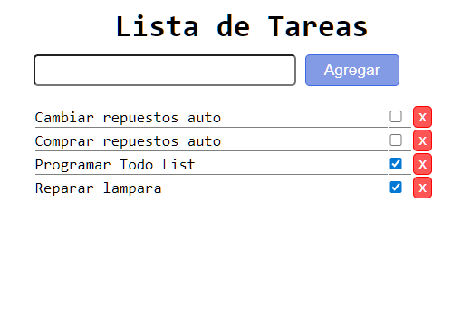

# ToDo List
  

Aplicación web simple para gestionar tareas diarias. Permite agregar, marcar como completadas y eliminar tareas, con persistencia en el LocalStorage del navegador.

## Características

- Agregar nuevas tareas  
- Marcar tareas como completadas  
- Eliminar tareas  
- Guardado automático en LocalStorage (las tareas se mantienen al recargar la página)  
- Interfaz minimalista y responsiva  

## Estructura del proyecto
```
todo-list/
├── index.html       # Extructura principal HTML
├── style.css        # Estilos CSS
├── index.js         # Lógica de Todo List
└── README.md
```

## Vista previa


## Tecnologías utilizadas
- HTML5
- CSS3
- JavaScript (ES6+)
- LocalStorage para persistencia de datos

## Próximas mejoras (ideas)
- Editar tareas existentes
- Agregar fechas límite
- Filtro de tareas (todas, completadas, pendientes)
- Modo oscuro


